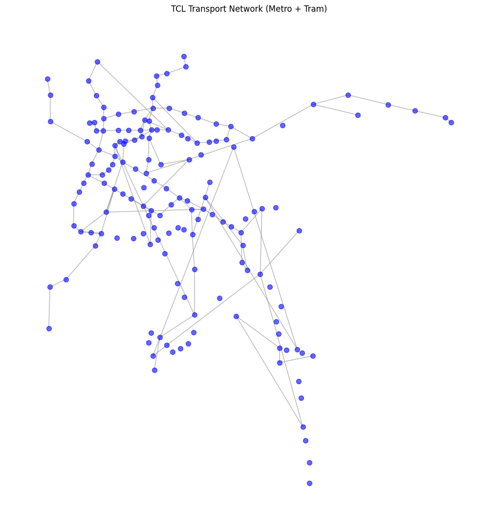

# TCL Lyon Transport Network Graph

## Project Overview

This project models the TCL (Transports en Commun Lyonnais) public transportation network as a graph structure to enable efficient route planning and network analysis across Lyon's metros and trams systems.

## Core Concept: Unified Stop Representation

### The Node Merging Approach

A key design principle of this project is that **all stops sharing the same name or address are treated as a single node** in the graph, regardless of which transport line serves them.

#### Why This Matters

In real-world transportation networks, the same physical location is often served by multiple lines:
- **Metro stations** where multiple lines intersect (e.g., "Charpennes Charles Hernu" serves Metro A, B, Tram T1, T4, and bus C2)
- **Tram stops** that share platforms or are within walking distance

#### Implementation Benefits

1. **Natural Transfer Points**: When multiple lines serve the same stop, passengers can transfer between them at that location. By merging these into a single node, transfers are implicit in the graph structure.

2. **Simplified Route Planning**: From any point in the network, the graph automatically considers all available transport options, not just a single line.

3. **Real-World Navigation**: Mirrors how passengers actually think: "I'm at Bellecour - which lines can I take to reach my destination?" rather than "I'm at Bellecour on Metro A specifically."

4. **Reduced Graph Complexity**: Instead of having separate nodes for "Bellecour (Metro A)", "Bellecour (Metro D)", "Bellecour (Bus C10)", we have one "Bellecour" node connected to all relevant lines.

### Example Scenario

**Question**: "I'm at Saxe - Gambetta. How can I reach Vaulx-en-Velin La Soie using the TCL network?"

**Without Node Merging**:
- You'd need to specify: "I'm at Saxe - Gambetta on Metro B"
- The system would only consider paths starting from that specific node
- Transfer points would need explicit modeling

**With Node Merging** (Our Approach):
- You simply say: "I'm at Saxe - Gambetta"
- The system knows this location is served by:
  - Metro B
  - Metro D
  - Tram T1
- All possible routes from any of these lines are automatically considered
- Optimal path selection happens naturally

## Graph Structure

### Graph Properties

- **UnDirected Graph**: Travel is bidirectional on all lines
- **UnWeighted Edges**: Can represent time, distance, or stop count but ignored for basic analysis

### Nodes
- **Node ID**: Unique stop name (e.g., "Bellecour", "Perrache", "Charpennes Charles Hernu")
- **Node Attributes**: 
  - Stop name
  - List of lines serving this stop
  - Coordinates

### Edges
- **Connection Type**: Sequential stops on the same line

### Multi-Modal Integration

The graph seamlessly integrates:
- **4 Metro lines** (A, B, C, D)
- **7 Tram lines** (T1-T7)
- **TramBus** (TB11)

## Use Cases

1. **Route Finding**: Find the shortest path between any two stops in the network
2. **Transfer Optimization**: Identify optimal transfer points for multi-line journeys
3. **Network Analysis**: Analyze connectivity, central hubs, and network robustness
4. **Accessibility Mapping**: Determine reachability from any point in the network
5. **Service Planning**: Identify underserved areas or potential new connections

## Key Advantages

- **Intuitive**: Matches mental model of "being at a location" rather than "being on a specific line"
- **Comprehensive**: Can consider all transport options
- **Flexible**: Works for any journey type (single line, transfers, multi-modal)

## Future Enhancements

- **Walking Connections**: Add edges for nearby stops that aren't officially connected
- **Real-Time Data**: Integrate live departure times and service disruptions
- **Cost Optimization**: Consider fare zones and ticket prices
- **Accessibility Features**: Include wheelchair access and elevator availability
- **Time-Dependent Routing**: Account for service schedules and frequencies